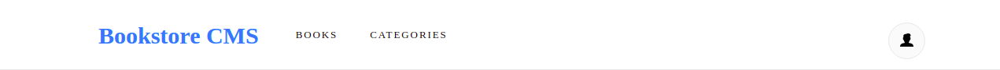
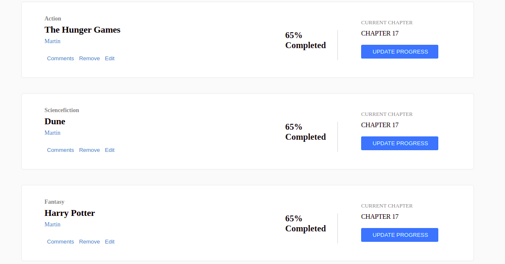
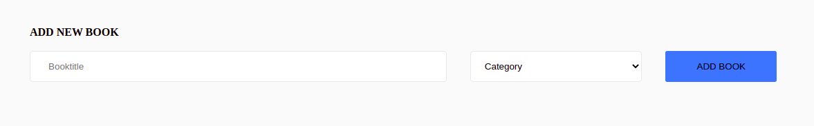

# Describtion

Bookstore CMS .

# live Demo
 [Bookstore CMS]()

# Navigation Bar

| |
| :------------: |

# Main Section

| 
| :------------: |
|  Main Section 1 |

# Add New book 

|  |
| :------------: |

## Installation

- Clone the repository , use  `git@github.com:Abdona/BookStore.git` 
- open terminal and change Directory, use `cd BookStore`
- Install all Dependencies, use `npm install` or `npm i`

## Usage

### Development server
- to run the Webapp you need to use `npm run start`

You can now view the development server at `localhost:3030`.

# Getting Start with Testing

- open your Terminal and Navigate to the project destination and type `npm install`
- run `npm run test`

## Built With

- React.js

## Author

# 👤 Abdulrahman Naser
- GitHub: [@githubhandle](https://github.com/Abdona)
- LinkedIn: [LinkedIn](https://www.linkedin.com/in/abdulrahman-nasser-2b7173131/)

## 🤝 Contributing

Contributions, issues, and feature requests are welcome!

Feel free to check the [issues page]().

## Show your support

Give a ⭐️ if you like this project!

## Inspiration
Microverse

## 📝 License

This project is [MIT]() licensed.